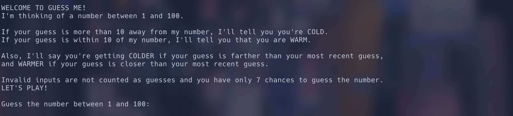
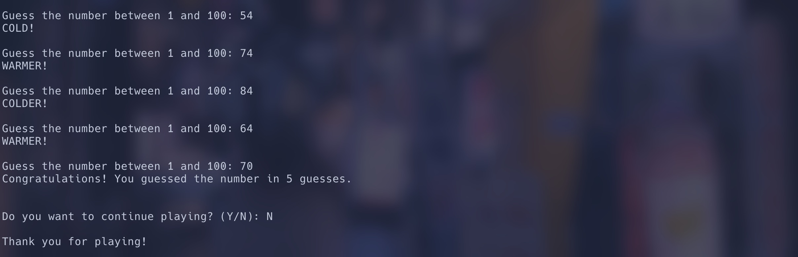

# Guess-The-Number-CLI-Python


Number guessing game in Python.

## Running Guess-The-Number

```zsh
git clone https://github.com/berkaykush/Guess-The-Number-CLI-Python.git
cd Guess-The-Number-CLI-Python/code
python main.py
```

<https://user-images.githubusercontent.com/70837975/207434946-73d8dea3-9ae8-4901-81aa-94b78474aa26.mov>

## Screenshots




## Author

Berkay Kush
